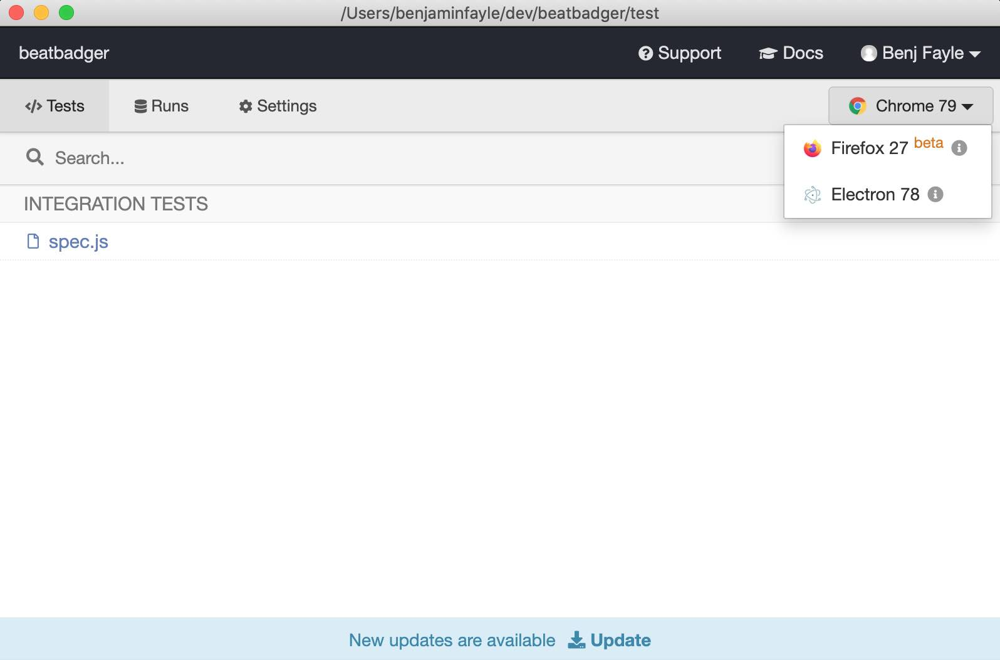

# SANDstack Starter

This project is a starter for building a SANDstack ([Sveltejs](https://svelte.dev/)/[Sapper](https://sapper.svelte.dev/), [Apollo GraphQL](https://www.apollographql.com/), [Neo4j Database](https://neo4j.com/neo4j-graph-database/)) application. There are two components to the starter, the UI application (a Svelte/Sapper app) and the API app (GraphQL server).

This project used as a starting point the api component from the [GRANDstack](https://grandstack.io) project and the default [Sapper template](https://github.com/sveltejs/sapper-template).

The master branch **DOES NOT USE** [Svelte Apollo](https://github.com/timhall/svelte-apollo) There is a separate branch the demonstrates it's use but it is not needed for most use cases.

If you are new to Svelete this is a good [introductory video](https://youtu.be/AdNJ3fydeao)

The GRANDStack documentation provides a good overview of the [Neo4j GraphQL](https://grandstack.io/docs/neo4j-graphql-overview.html) integration.

## Setting up a development environment

Follow [these instructions first](./README-DEV.md)

## Quickstart

You can quickly start using Docker engine version 19 or later:

```
docker-compose -f docker-compose.yml -f docker-compose-stage.yml up --build
```

List the running containers:

```
docker ps
```

There should be three containers started:

```
CONTAINER ID        IMAGE                      COMMAND                  CREATED             STATUS              PORTS                                                      NAMES
625acfa444fa        sand-stack-starter_ui      "docker-entrypoint.s…"   3 minutes ago       Up 2 minutes        0.0.0.0:3000->3000/tcp                                     sand-stack-starter_ui_1
843c5ea8d997        sand-stack-starter_api     "docker-entrypoint.s…"   3 minutes ago       Up 2 minutes        0.0.0.0:4001->4001/tcp                                     sand-stack-starter_api_1
8ae79170f66e        sand-stack-starter_neo4j   "/sbin/tini -g -- /d…"   3 minutes ago       Up 3 minutes        0.0.0.0:7474->7474/tcp, 7473/tcp, 0.0.0.0:7687->7687/tcp   sand-stack-starter_neo4j_1
```

Initially the database is empty. Run the test suite automatically loads the database with sample data.

```
cd test
npm install
npx cypress run
```

The application should be running at [localhost:3000](http://localhost:3000)


## Development mode

The project is set up to allow the api and ui servers to run in dev mode. This mode enables a watch on all files and automatically deploys when changes are saved. The following instructions show you how to start each server component separately.

If you've run the docker-compose script be sure to shut down the docker containers before starting in development mode.

```
docker-compose down
```

Be sure your development machine is running Node version 12.

```
node --version
```

### Neo4j

There are many ways to run Neo4j for development purposes. The [README](neo4j/README.md) in the `neo4j` directory describes several approaches. However the simplest is to start a stand alone Docker container using the DockerFile provided.

```
 docker-compose up --detach --remove-orphans
```

List the running containers:

```
docker ps
```

You should see a neo4j container:

```
CONTAINER ID        IMAGE               COMMAND                  CREATED             STATUS              PORTS                                                      NAMES
3c95a2947d49        neo4j               "/sbin/tini -g -- /d…"   9 seconds ago       Up 8 seconds        0.0.0.0:7474->7474/tcp, 7473/tcp, 0.0.0.0:7687->7687/tcp   neo4j-db
```

You should now be able to access the Neo4j database browser at [localhost:7474](http://localhost:7474) (you can log in using neo4j/letmein). Click the `*()` under `Node Labels` to list a sample of nodes.


### Install dependencies

```
(cd ../ui && npm install)
(cd ../api && npm install)
```

### Start API Server

Open a new terminal

```
cd api
npm run dev
```

This will start the GraphQL API server in dev mode.

You should also be able to access the Apollo GraphQL playground at [localhost:4001/graphql](http://localhost:4001/graphql) This allows you to interactively test your GraphQL before using it in your application.


### Start UI Server

Open a new terminal

```
cd ui
npm run dev
```

This will start the Svelte Sapper app in dev mode. In dev mode when a file change is saved in the `ui` directory the web page should automatically reload with the changes.

### Start Cypress Test Server

Open a new terminal

```
cd test
npx cypress open
```

The test runner lets you select the browser you wish to use for testing.


We've found as as apps get larger and more complex it is often necessay to add [cy.wait(time)](https://docs.cypress.io/api/commands/wait.html#Syntax) to make the test stable on slower CI machines. These are end to end tests so many factors can affect test performance.

### Sapper Export

This simple example is a readonly app and a candidate for [Sapper Export](https://sapper.svelte.dev/docs#Exporting)

For the export to run properly the `neo4j` and `api` servers must be running.

Open a new terminal

```
cd ui
npx sapper export
```

This will create a `/ui/__sapper__/export` folder with a production-ready build of your site. You can launch it like so:

```
npx serve __sapper__/export
```

### Sapper Environment

The `ui` app makes use of the [Sapper Environment npm](https://www.npmjs.com/package/sapper-environment). These are environment variables that are replaced at build time so they can be used in client code. Any environment variable with prefix `SAPPER_APP_` is for use in the client code.

We make especial use of this in `/ui/src/apollo.js`. The Apollo GraphQl client is used in both the browser and SSR. In dev mode they have the same value.

```
SSR_GRAPHQL_URI=http://localhost:4001/graphql
SAPPER_APP_GRAPHQL_URI=http://localhost:4001/graphql
```

However in production they are often different as the `SAPPER_APP_GRAPHQL_URI` is the public address of the api server and `SSR_GRAPHQL_URI` is the internal address of the server. An example of this can be seen in `docker-compose-stage.yml`.
